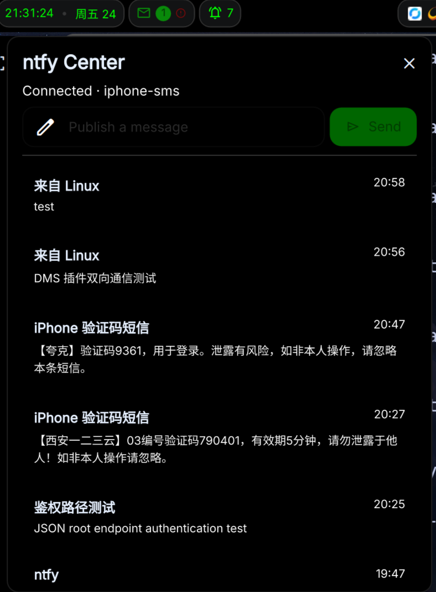

# dms-ntfy-center

一个面向 [DankMaterialShell](https://github.com/AvengeMedia/DankMaterialShell)
的 ntfy 消息中心插件。它可以在后台持续接收 ntfy 消息、显示桌面通知和消息
历史，也可以直接从 DankBar 向同一主题发布自定义文本。



## 为什么做这个插件

这个插件最初源于一个很具体的需求：让 iPhone 在收到验证码短信后，通过快捷
指令把完整短信转发到自建 ntfy，再让 Linux 桌面无需打开网页就能立即收到。

在实际使用中，需求很快不再局限于验证码。不同设备之间还需要发送普通通知、
临时文本和自定义消息。因此项目被整理成了一个通用 ntfy 客户端：不绑定某个
服务器、主题或 iPhone 工作流，任何能够向 ntfy 发布消息的设备都可以与它通信。

## 功能

- 后台保持 ntfy JSON 流订阅，无需打开浏览器
- 连接中断后自动重连
- 将新消息发送到 DMS 通知中心并显示桌面通知
- 在 DankBar 弹出面板中查看最近消息
- 自动识别中英文短信中的数字或字母数字验证码
- 点击验证码消息复制验证码，普通消息仍复制完整正文
- 从 DankBar 直接发布自定义文本
- 支持 Access Token 与 HTTP Basic 认证
- 支持自建 ntfy 和官方 `ntfy.sh`
- 所有选项均在 DMS 插件设置中管理
- 仅使用 Python 标准库，无第三方 Python 依赖

## 前置条件

- DankMaterialShell 1.5.0 或更高版本
- Python 3.10 或更高版本
- 一个可访问的 ntfy 服务
- 一个 ntfy 主题
- 若主题受保护，需要具备读取和发布权限的 Token，或用户名与密码

插件同时包含后台 daemon 和 DankBar widget，因此依赖 DMS 1.5.0 引入的
composite plugin 支持。

## 安装

### 使用 Git

```bash
git clone https://github.com/Gm-aaa/dms-ntfy-center.git \
  ~/.config/DankMaterialShell/plugins/ntfyCenter
```

### 使用本地源码目录

开发或调试时，可以把项目链接到 DMS 插件目录：

```bash
ln -s /path/to/dms-ntfy-center \
  ~/.config/DankMaterialShell/plugins/ntfyCenter
```

安装文件后：

1. 打开 DMS 设置。
2. 进入 `Plugins`。
3. 点击扫描插件。
4. 启用 `ntfy Center`。
5. 如果状态栏没有自动出现图标，在 DankBar 布局中加入 `ntfyCenter`。
6. 打开插件设置并填写服务器地址、主题和认证信息。

也可以通过命令重新加载插件：

```bash
dms ipc call plugins reload ntfyCenter
```

检查运行状态：

```bash
dms ipc call ntfyCenter status
```

## 配置项

所有配置都保存在 DMS 自己的 `ntfyCenter` 插件设置命名空间中，不需要手动
创建或编辑额外的 JSON 配置文件。

| 配置项 | 默认值 | 说明 |
| --- | --- | --- |
| Server URL | `https://ntfy.sh` | ntfy 服务根地址，不要附加主题路径 |
| Topic | 空 | 用于订阅和发布的 ntfy 主题 |
| Access token | 空 | Bearer Token；填写后优先于用户名和密码 |
| Username | 空 | 可选的 HTTP Basic 用户名 |
| Password | 空 | 可选的 HTTP Basic 密码 |
| Verify TLS certificates | 开启 | 验证 HTTPS 证书；仅自签名环境需要关闭 |
| Show desktop notifications | 开启 | 收到新消息时显示 DMS 桌面通知 |
| Message history limit | `20` | 弹出面板最多保留的消息数量，可设为 5–50 |
| History window | `24h` | 启动时读取的历史时间范围，可设为 1–168 小时 |
| Default publish title | `From Linux` | 从插件发送自定义文本时使用的标题 |

### 认证优先级

如果填写了 Access Token，插件会使用：

```text
Authorization: Bearer <token>
```

如果 Token 留空但填写了用户名，则使用 HTTP Basic 认证。两种认证信息都为空
时，插件会按公开主题访问。

建议为插件创建仅能读写目标主题的独立 ntfy 用户或 Token。

## 工作方式

插件由三个部分组成：

- `NtfyDaemon.qml`：维护后台订阅、自动重连、历史记录和桌面通知。
- `NtfyWidget.qml`：提供 DankBar 图标、消息列表和文本发布界面。
- `scripts/ntfy_client.py`：使用 Python 标准库访问 ntfy HTTP/JSON API。

QML 将连接配置通过标准输入交给 helper，认证信息不会出现在进程命令行参数
中。最近一条实时消息的 ID 会保存在用户状态目录，用于重连时避免重复通知。

## 安全说明

Token 和密码在设置界面中会以密码框显示，但 DMS 插件设置并不是加密的秘密
存储。请保护好用户配置目录，不要把个人的 DMS 配置文件提交到公开仓库。

关闭 TLS 验证会降低连接安全性，只应在可信网络中的自签名服务上使用。

## 开发与验证

```bash
qmllint -I /usr/share/quickshell/dms \
  NtfyDaemon.qml NtfyWidget.qml NtfySettings.qml

python3 -m py_compile scripts/ntfy_client.py

python3 -m unittest discover -s tests

jq empty plugin.json
```

## 更新记录

参见 [CHANGELOG.md](CHANGELOG.md)。

## License

本项目使用 [MIT License](LICENSE)。
